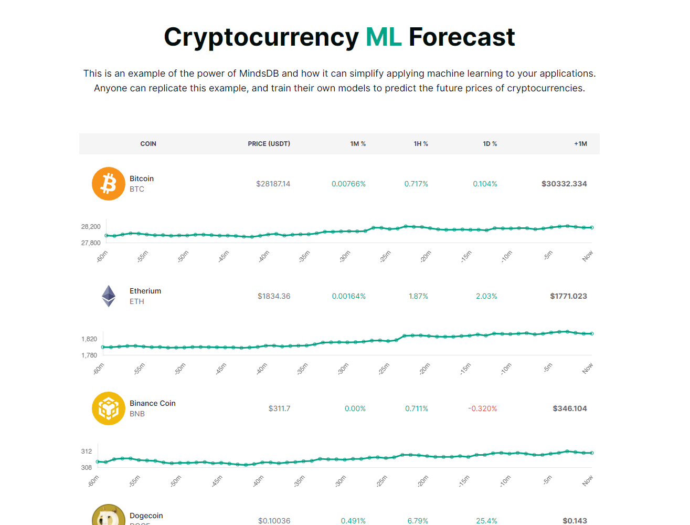

# Example MindsDB Web Application: Crypto ML Forecasting
This is an example of the power of MindsDB and how it can simplify applying machine learning to your applications. We will train our own ML models and use them to predict the price of several cryptocurrencies against [USDT](https://tether.to/) a minute into the future. Anyone can replicate this example, and train their own models to predict the future prices of cryptocurrencies.

This example uses the [Express](https://expressjs.com/) framework for the backend and [Tailwind CSS](https://tailwindcss.com/) for the frontend, but you can apply the concepts here to any framework.

| **NOTE**: This is an example project used for educational purposes. MindsDB does not recommend using these ML models to influence real trading decisions. MindsDB is not in any way affiliated with coins used in this example.

<br>

## What it Looks Like



## Installation

First, clone the repository

`git clone https://github.com/mindsdb/js-example.git`

Next, you need to install dependencies.

`cd js-example && npm install`

## Training Models

Before you can run the application locally, you need to train your own models to use. We provided a handy script `trainCoinModel.js` for this. This example uses the following coins:

* Bitcoin (BTC)
* Etherium (ETH)
* Binance Coin (BNB)
* Dogecoin (DOGE)
* Solana (SOL)

You can run `node ./scripts/trainCoinModel.js --help` to see how to customize your models more. Here's the simplest way to train all the models you need:

`node ./scripts/trainCoinModel.js --pair btcusdt`

`node ./scripts/trainCoinModel.js --pair ethusdt`

`node ./scripts/trainCoinModel.js --pair bnbusdt`

`node ./scripts/trainCoinModel.js --pair dogeusdt`

`node ./scripts/trainCoinModel.js --pair solusdt`

## Configuration

First, make sure you enter your MindsDB Cloud username and password into `./config/mindsdb-config.json`. Without this, you won't be able to connect and authenticate properly.
```
{
  "host": "https://cloud.mindsdb.com",
  "user": "YOUR USERNAME HERE",
  "password": "YOUR PASSWORD HERE"
}
```

Or if running locally

```
{
  "host": "http://127.0.0.1:47334"
}
```

Finally, make sure `./config/model-config.json` has the right names of the models you trained. You only need to change this if you provided custom names to your models when training, using the `--name` option.

```
{
  "btcusdt": "btcusdt_model",
  "ethusdt": "ethusdt_model",
  "bnbusdt": "bnbusdt_model",
  "dogeusdt": "dogeusdt_model",
  "solusdt": "solusdt_model"
}
```

## Running Locally

After you've done everything above, you're ready to run the example locally!

First, watch for local changes so you automatically rebuild the CSS styles:

`npm run watch`

Next, open up a new terminal to spin up the Express server:

`npm run dev`

You should be able to navigate to [localhost:3000](http://localhost:3000) to see the example running with real data.
